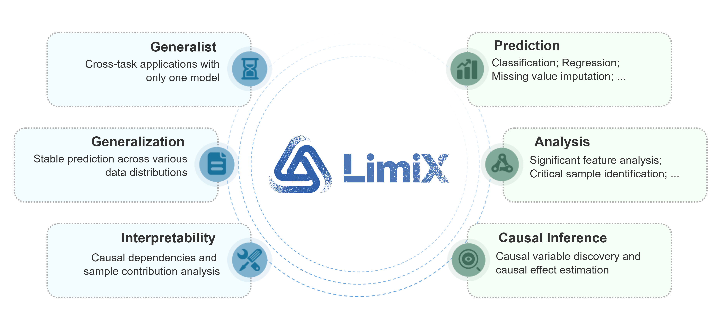
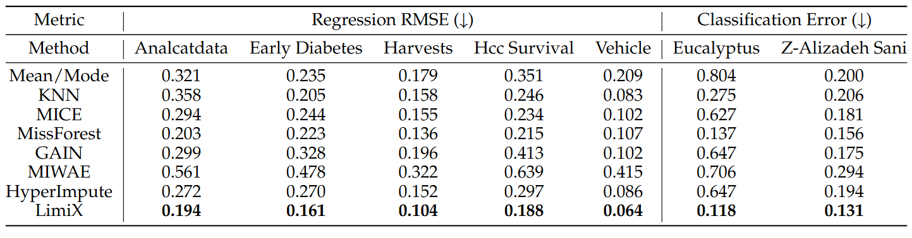

<div align="center">
  
</div>

# News :boom: 
 - 2025-08-29: LimiX V1.0 Released.

# ➤ Overview
<div align="center">
  
</div>
we introduce LimiX, the first installment of our LDM series. LimiX aims to push generality further: a single model that handles classification, regression, missing-value imputation, feature selection, sample selection, and causal inference under one training and inference recipe, advancing the shift from bespoke pipelines to unified, foundation-style tabular learning.

LimiX adopts a transformer architecture optimized for structured data modeling and task generalization. The model first embeds features X and targets Y from the prior knowledge base into token representations. Within the core modules, attention mechanisms are applied across both sample and feature dimensions to identify salient patterns in key samples and features. The resulting high-dimensional representations are then passed to regression and classification heads, enabling the model to support diverse predictive tasks. 

For details, please refer to the technical report at the link: [LimiX_Technical_Report.pdf](https://github.com/limix-ldm/LimiX/blob/main/LimiX_Technical_Report.pdf)

# ➤ Superior Performance 
The LimiX model achieved SOTA performance across multiple tasks.

## ➩ Classification
<div align="center">
  
</div>

## ➩ Regression
<div align="center">
  
</div>

## ➩ Missing Values Imputation
<div align="center">
  
</div>

# ➤ Tutorials 
## ➩ Installation
### Option 1 (recommended): Use the Dockerfile
Download [Dockerfile](https://github.com/limix-ldm/LimiX/blob/main/Dockerfile)
```bash
docker build --network=host -t limix/infe:v1 --build-arg FROM_IMAGES=nvidia/cuda:12.2.0-base-ubuntu22.04 -f Dockerfile .
```

### Option 2: Build manually
Download the prebuilt flash_attn files
```bash
wget -O flash_attn-2.8.0.post2+cu12torch2.7cxx11abiTRUE-cp312-cp312-linux_x86_64.whl https://github.com/Dao-AILab/flash-attention/releases/download/v2.8.0.post2/flash_attn-2.8.0.post2+cu12torch2.7cxx11abiTRUE-cp312-cp312-linux_x86_64.whl
```
Install Python dependencies
```bash
pip install python==3.12.7 torch==2.7.1 torchvision==0.22.1 torchaudio==2.7.1
pip install flash_attn-2.8.0.post2+cu12torch2.7cxx11abiTRUE-cp312-cp312-linux_x86_64.whl
pip install scikit-learn  einops  huggingface-hub matplotlib networkx numpy pandas  scipy tqdm typing_extensions xgboost
```

### Download source code
```bash
git clone https://github.com/limix-ldm/LimiX.git
cd LimiX
```

# ➤ Inference
LimiX supports tasks such as classification, regression, and missing value imputation
## ➩ Model download
| Model size | Download link | Tasks supported |
| --- | --- | --- |
| LimiX-16M | [LimiX-16M.ckpt](https://huggingface.co/stableai-org/LimiX-16M/tree/main) |  ✅ classification  ✅regression   ✅missing value imputation |

## ➩ Interface description

### Model Creation
```python
class LimiXPredictor:
    def __init__(self,
                 device:torch.device,
                 model_path:str,
                 mix_precision:bool=True,
                 inference_config: list|str,
                 categorical_features_indices:List[int]|None=None,
                 outlier_remove_std: float=12,
                 softmax_temperature:float=0.9,
                 task_type: Literal['Classification', 'Regression']='Classification',
                 mask_prediction:bool=False,
                 inference_with_DDP: bool = False,
                 seed:int=0)
```
| Parameter | Data Type | Description |
|--------|----------|----------|
| device | torch.device | The hardware that loads the model |
| model_path | str | The path to the model that needs to be loaded |
| mix_precision | bool | Whether to enable the mixed precision inference |
| inference_config | list/str | Configuration file used for inference |
| categorical_features_indices | list | The indices of categorical columns in the tabular data |
| outlier_remove_std | float | The threshold is employed to remove outliers, defined as values that are multiples of the standard deviation |
| softmax_temperature | float | The temperature used to control the behavior of softmax operator |
| task_type | str | The task type which can be either "Classification" or "Regression" |
| mask_prediction | bool | Whether to enable missing value imputation |
| inference_with_DDP | bool | Whether to enable DDP during inference |
| seed | int | The seed to control random states |
### Predict
```python
def predict(self, x_train:np.ndarray, y_train:np.ndarray, x_test:np.ndarray) -> np.ndarray:
```
| Parameter   | Data Type    | Description           |
| ------- | ---------- | ----------------- |
| x_train  | np.ndarray  | The input features of the training set   |
| y_train  | np.ndarray  | The target variable of the training set   |
| x_test   | np.ndarray  | The input features of the test set   |

## ➩ Ensemble Inference Based on Sample Retrieval

For a detailed technical introduction to Ensemble Inference Based on Sample Retrieval, please refer to the [technical report](https://github.com/limix-ldm/LimiX/blob/main/LimiX_Technical_Report.pdf).

Considering inference speed, ensemble inference based on sample retrieval currently only supports hardware with specifications higher than the NVIDIA RTX 4090 GPU.

### Classification Task

```
torchrun --nproc_per_node=8 inference_classifier.py --save_name your_save_name --inference_config_path path_to_config --data_dir path_to_data
```

### Regression Task

```
torchrun --nproc_per_node=8 inference_regression.py --save_name your_save_name --inference_config_path path_to_config --data_dir path_to_data
```

### Customizing Data Preprocessing for Inference Tasks
#### First, Generate the Inference Configuration File

```python
generate_inference_config()
```

### Classification Task
#### Single GPU or CPU

```
python  inference_classifier.py --save_name your_save_name --inference_config_path path_to_config --data_dir path_to_data
```

#### Multi-GPU Distributed Inference

```
torchrun --nproc_per_node=8  inference_classifier.py --save_name your_save_name --inference_config_path path_to_config --data_dir path_to_data --inference_with_DDP
```

### Regression Task
#### Single GPU or CPU

```
python  inference_regression.py --save_name your_save_name --inference_config_path path_to_config --data_dir path_to_data
```

#### Multi-GPU Distributed Inference

```
torchrun --nproc_per_node=8  inference_regression.py --save_name your_save_name --inference_config_path path_to_config --data_dir path_to_data --inference_with_DDP
```

## ➩ Classification
```python
from sklearn.datasets import load_breast_cancer
from sklearn.metrics import accuracy_score, roc_auc_score
from sklearn.model_selection import train_test_split
from huggingface_hub import hf_hub_download
import numpy as np
import os, sys

ROOT_DIR = os.path.abspath(os.path.join(os.path.dirname(__file__), ".."))
if ROOT_DIR not in sys.path:
    sys.path.insert(0, ROOT_DIR)
from inference.predictor import LimiXPredictor

X, y = load_breast_cancer(return_X_y=True)
X_train, X_test, y_train, y_test = train_test_split(X, y, test_size=0.5, random_state=42)

model_file = hf_hub_download(repo_id="stableai-org/LimiX-16M", filename="LimiX-16M.ckpt", local_dir="./cache")

clf = LimiXPredictor(device='cuda', model_path=model_file, inference_config='config/cls_default_noretrieval.json')
prediction = clf.predict(X_train, y_train, X_test)

print("roc_auc_score:", roc_auc_score(y_test, prediction[:, 1]))
print("accuracy_score:", accuracy_score(y_test, np.argmax(prediction, axis=1)))
```
For additional examples, refer to [inference_classifier.py](./inference_classifier.py)

## ➩ Regression
```python
from functools import partial

from sklearn.datasets import fetch_california_housing
from sklearn.model_selection import train_test_split
from sklearn.metrics import r2_score
from huggingface_hub import hf_hub_download
try:
    from sklearn.metrics import root_mean_squared_error as mean_squared_error
except:
    from sklearn.metrics import mean_squared_error
    mean_squared_error = partial(mean_squared_error, squared=False)
import os, sys
ROOT_DIR = os.path.abspath(os.path.join(os.path.dirname(__file__), ".."))
if ROOT_DIR not in sys.path:
    sys.path.insert(0, ROOT_DIR)
from inference.predictor import LimiXPredictor

house_data = fetch_california_housing()
X, y = house_data.data, house_data.target
X_train, X_test, y_train, y_test = train_test_split(X, y, test_size=0.33, random_state=42)

y_mean = y_train.mean()
y_std = y_train.std()
y_train_normalized = (y_train - y_mean) / y_std
y_test_normalized = (y_test - y_mean) / y_std

model_path = hf_hub_download(repo_id="stableai-org/LimiX-16M", filename="LimiX-16M.ckpt", local_dir="./cache")

model = LimiXPredictor(device='cuda', model_path=model_path, inference_config='config/reg_default_noretrieval.json')
y_pred = model.predict(X_train, y_train_normalized, X_test)    

# Compute RMSE and R²
y_pred = y_pred.to('cpu').numpy()
rmse = mean_squared_error(y_test_normalized, y_pred)
r2 = r2_score(y_test_normalized, y_pred)

print(f'RMSE: {rmse}')
print(f'R2: {r2}')
```
For additional examples, refer to [inference_regression.py](./inference_regression.py)

## ➩ Missing value imputation
For the demo file, see [examples/demo_missing_value_imputation.py](examples/inference_regression.py)

# ➤ Link
 - LimiX Technical Report: [LimiX_Technical_Report.pdf](https://github.com/limix-ldm/LimiX/blob/main/LimiX_Technical_Report.pdf)
 - Balance Comprehensive Challenging Omni-domain Classification Benchmark: [bcco_cls](https://huggingface.co/datasets/stableai-org/bcco_cls)
 - Balance Comprehensive Challenging Omni-domain Regression Benchmark: [bcco_reg](https://huggingface.co/datasets/stableai-org/bcco_reg)

# ➤ License
The code in this repository is open-sourced under the [Apache-2.0](LICENSE.txt) license, while the usage of the LimiX model weights is subject to the Model License. The LimiX weights are fully available for academic research and may be used commercially upon obtaining proper authorization.

# ➤ Reference