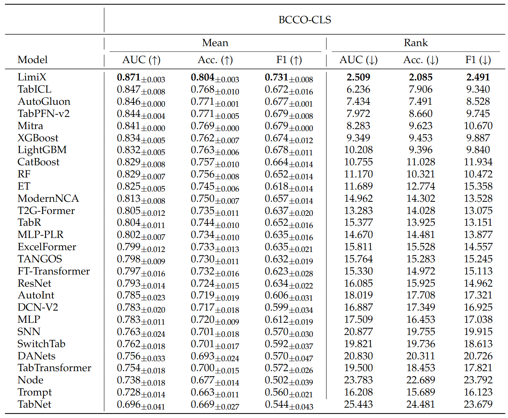
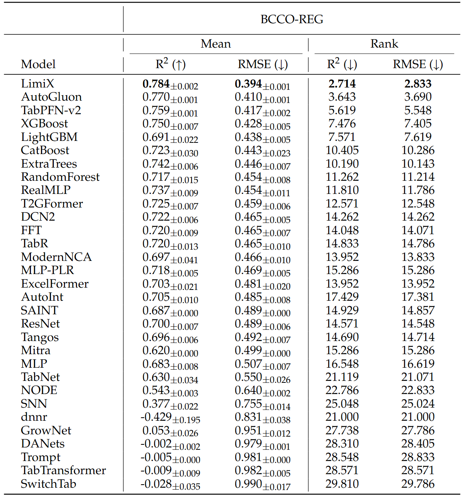
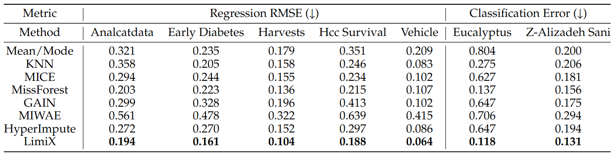

<div align="center">
  
</div>

# 最新进展 :boom: 
 - 2025-08-29: LimiX V1.0 发布

# ➤ 简介
<div align="center">
  
</div>
我们推出 LDM 系列的首个模型—极数。极数的目标在于进一步提升通用性：在统一的训练与推理框架下，同时处理分类、回归、缺失值插补、特征选择、样本选择和因果推理等任务，从而推动表格学习从定制化流程迈向基础模型范式的转变。

极数基于专为结构化数据建模和任务泛化优化的 Transformer 架构。 模型首先将先验知识库中的特征 𝑋  与目标 𝑌 映射为 token 表示。在核心模块中，注意力机制同时作用于样本维度和特征维度，以捕捉关键样本与特征的显著模式。随后，高维表示被送入回归与分类模块，从而支持多种任务的输出。

技术报告详见：[LimiX_Technical_Report.pdf](https://github.com/limix-ldm/LimiX/blob/main/LimiX_Technical_Report.pdf)

# ➤ 对比测试
LimiX模型在多个任务的测试中达到了当前最优性能.
## ➩ 分类测试
<div align="center">
  
</div>

## ➩ 回归对比测试
<div align="center">
  
</div>

## ➩ 缺失值插补对比测试
<div align="center">
  
</div>


# ➤ 教程
## ➩ 安装
### 方式1，使用Dockerfile (建议)
下载[Dockerfile](https://github.com/limix-ldm/LimiX/blob/main/Dockerfile)
```bash
docker build --network=host -t limix/infe:v1 --build-arg FROM_IMAGES=nvidia/cuda:12.2.0-base-ubuntu22.04 -f Dockerfile .
```
### 方式2，自行构建环境
下载 flash_attn 预编译文件
```bash
wget -O flash_attn-2.8.0.post2+cu12torch2.7cxx11abiTRUE-cp312-cp312-linux_x86_64.whl https://github.com/Dao-AILab/flash-attention/releases/download/v2.8.0.post2/flash_attn-2.8.0.post2+cu12torch2.7cxx11abiTRUE-cp312-cp312-linux_x86_64.whl
```
环境安装
```bash
pip install python==3.12.7 torch==2.7.1 torchvision==0.22.1 torchaudio==2.7.1
pip install flash_attn-2.8.0.post2+cu12torch2.7cxx11abiTRUE-cp312-cp312-linux_x86_64.whl
pip install scikit-learn  einops  huggingface-hub matplotlib networkx numpy pandas  scipy tqdm typing_extensions xgboost
```

# ➤ 推理任务
LimiX支持分类、回归、缺失值插补等任务。
## ➩ 模型下载
| 模型尺寸 | 下载链接 | 支持的任务 |
| --- | --- | --- |
|  LimiX-16M | [LimiX-16M.ckpt](https://huggingface.co/stableai-org/LimiX-16M/tree/main) |  ✅ 分类  ✅回归   ✅缺失值插补 |


## ➩ 接口说明
### 创建模型
```python
class LimiXPredictor:
    def __init__(self,
                 device:torch.device,
                 model_path:str,
                 mix_precision:bool=True,
                 inference_config: list|str,
                 categorical_features_indices:List[int]|None=None,
                 outlier_remove_std: float=12,
                 softmax_temperature:float=0.9,
                 task_type: Literal['Classification', 'Regression']='Classification',
                 mask_prediction:bool=False,
                 inference_with_DDP: bool = False,
                 seed:int=0)
```
| 参数名 | 数据类型 | 参数说明 |
|--------|----------|----------|
| device | torch.device | 运行模型的硬件 |
| model_path | str | 需要加载的模型的路径 |
| mix_precision | bool | 是否启动混合进度计算 |
| inference_config | list/str | 推理使用的配置文件 |
| categorical_features_indices | list | 数据表中，分类列的序号 |
| outlier_remove_std | float | 移除异常值时采用的标准差倍数阈值 |
| softmax_temperature | float | Softmax 温度 或 温度系数 |
| task_type | str | 任务类型，取值范围为：Classification, Regression |
| mask_prediction | bool | 是否启用缺失值插补功能 |
| inference_with_DDP | bool | 在推理时是否开启DDP |
| seed | int | 随机种子 |
### 数据推理
```python
def predict(self, x_train:np.ndarray, y_train:np.ndarray, x_test:np.ndarray) -> np.ndarray:
```
| 参数名   | 数据类型    | 参数说明           |
| ------- | ---------- | ----------------- |
| x_train  | np.ndarray  | 训练集的 feature   |
| y_train  | np.ndarray  | 训练集的预测目标   |
| x_test   | np.ndarray  | 测试集的 feature   |

## ➩ 基于样本检索的ensemble推理
基于样本检索的ensemble推理的详细技术描述详见[LimiX技术报告](https://github.com/limix-ldm/LimiX/blob/main/LimiX_Technical_Report.pdf)
考虑到推理速度，基于样本检索的ensemble推理目前只支持基于版本高于NVIDIA-RTX 4090显卡的硬件条件。
### 分类任务
```
torchrun --nproc_per_node=8 inference_classifier.py --save_name your_save_name --inference_config_path path_to_config --data_dir path_to_data
```

### 回归任务
```
torchrun --nproc_per_node=8 inference_regression.py --save_name your_save_name --inference_config_path path_to_config --data_dir path_to_data
```

### 个性化设置推理任务的数据预处理方式
#### 首先生成inference_config文件
```python
generate_infenerce_config()
```

### 分类任务
#### 单卡或者CPU
```
python  inference_classifier.py --save_name your_save_name --inference_config_path path_to_config --data_dir path_to_data
```
#### 多卡分布式推理
```
torchrun --nproc_per_node=8  inference_classifier.py --save_name your_save_name --inference_config_path path_to_config --data_dir path_to_data --inference_with_DDP
```

### 回归任务
#### 单卡或者CPU
```
python  inference_regression.py --save_name your_save_name --inference_config_path path_to_config --data_dir path_to_data
```
#### 多卡分布式推理
```
torchrun --nproc_per_node=8  inference_regression.py --save_name your_save_name --inference_config_path path_to_config --data_dir path_to_data --inference_with_DDP
```

## ➩ 分类

```python
from sklearn.datasets import load_breast_cancer
from sklearn.metrics import accuracy_score, roc_auc_score
from sklearn.model_selection import train_test_split
from huggingface_hub import hf_hub_download
import numpy as np
import os, sys

ROOT_DIR = os.path.abspath(os.path.join(os.path.dirname(__file__), ".."))
if ROOT_DIR not in sys.path:
    sys.path.insert(0, ROOT_DIR)
from inference.predictor import LimiXPredictor

X, y = load_breast_cancer(return_X_y=True)
X_train, X_test, y_train, y_test = train_test_split(X, y, test_size=0.5, random_state=42)

model_file = hf_hub_download(repo_id="stableai-org/LimiX-16M", filename="LimiX-16M.ckpt", local_dir="./cache")

clf = LimiXPredictor(device='cuda', model_path=model_file, inference_config='config/cls_default_noretrieval.json')
prediction = clf.predict(X_train, y_train, X_test)

print("roc_auc_score:", roc_auc_score(y_test, prediction[:, 1]))
print("accuracy_score:", accuracy_score(y_test, np.argmax(prediction, axis=1)))
```
更加详细的样例详见： [inference_classifier.py](./inference_classifier.py)

## ➩ 回归
```python
from functools import partial

from sklearn.datasets import fetch_california_housing
from sklearn.model_selection import train_test_split
from sklearn.metrics import r2_score
from huggingface_hub import hf_hub_download
try:
    from sklearn.metrics import root_mean_squared_error as mean_squared_error
except:
    from sklearn.metrics import mean_squared_error
    mean_squared_error = partial(mean_squared_error, squared=False)
import os, sys
ROOT_DIR = os.path.abspath(os.path.join(os.path.dirname(__file__), ".."))
if ROOT_DIR not in sys.path:
    sys.path.insert(0, ROOT_DIR)
from inference.predictor import LimiXPredictor

house_data = fetch_california_housing()
X, y = house_data.data, house_data.target
X_train, X_test, y_train, y_test = train_test_split(X, y, test_size=0.33, random_state=42)

y_mean = y_train.mean()
y_std = y_train.std()
y_train_normalized = (y_train - y_mean) / y_std
y_test_normalized = (y_test - y_mean) / y_std

data_device = f'cuda:0'
model_path = hf_hub_download(repo_id="stableai-org/LimiX-16M", filename="LimiX-16M.ckpt", local_dir="./cache")

model = LimiXPredictor(device='cuda', model_path=model_path, inference_config='config/reg_default_noretrieval.json')
y_pred = model.predict(X_train, y_train_normalized, X_test)    

# Compute RMSE and R²
y_pred = y_pred.to('cpu').numpy()
rmse = mean_squared_error(y_test_normalized, y_pred)
r2 = r2_score(y_test_normalized, y_pred)

print(f'RMSE: {rmse}')
print(f'R2: {r2}')
```
更加详细的样例详见： [inference_regression.py](./inference_regression.py)

## ➩ 缺失值插补
样例详见： [examples/demo_missing_value_imputation.py](examples/inference_regression.py)

# ➤ 链接
 - LimiX技术报告：[LimiX_Technical_Report.pdf](https://github.com/limix-ldm/LimiX/blob/main/LimiX_Technical_Report.pdf)
 - 平衡、全面、有挑战、跨领域的分类数据集：[bcco_cls](https://huggingface.co/datasets/stableai-org/bcco_cls)
 - 平衡、全面、有挑战、跨领域的回归数据集：[bcco_reg](https://huggingface.co/datasets/stableai-org/bcco_reg)

# ➤ 协议
本仓库的代码依照 [Apache-2.0](LICENSE.txt) 协议开源，LimiX 模型的权重的使用则需要遵循 Model License。LimiX 权重对学术研究完全开放，在进行授权后允许商业使用。

# ➤ 引用